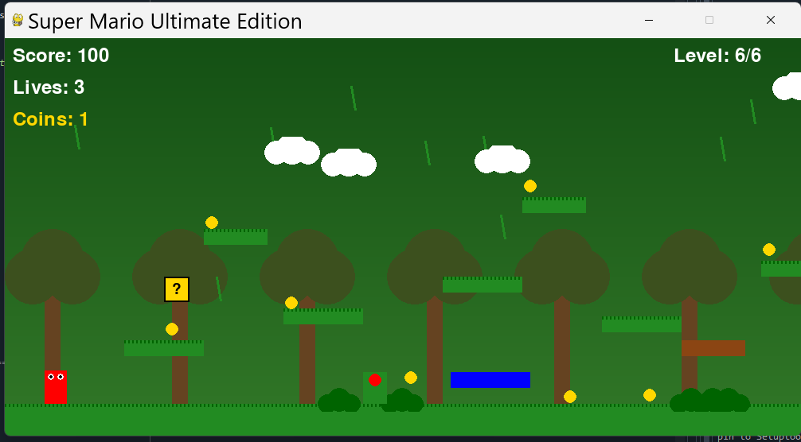

# 🎮 Super Mario Ultimate Edition



> **COMP2116 Software Engineering Final Project**  
> Macao Polytechnic University · 2024/2025 Semester 2

---

## 📖 Project Overview

**Super Mario Ultimate Edition** is a 2D platformer game developed with Pygame, inspired by the classic *Super Mario* series. This project follows the **Agile development** methodology, delivering **6 fully playable levels**, **4 power‑up systems**, a **boss battle**, and a **scrolling camera** for extended maps within a two‑week sprint.

**Target Audience**: Casual gamers, Pygame learners, and software engineering course demonstrations.

---

## 🎯 Project Purpose

### Why Agile?

Given the moderate scope and evolving design requirements (e.g., level layouts, power‑up mechanics), we adopted **Scrum** with weekly sprints. Daily stand‑ups and iterative deliverables allowed us to quickly integrate feedback and resolve bugs.

### Target Market

- Educational demonstration of software engineering workflows  
- Indie game enthusiast communities  
- Learning resource for Pygame development

---

## 📅 Development Plan

### Team Roles & Contributions

| Student ID | Name               | Contribution Description                                                                                                                                                 | Portion |
|------------|--------------------|-------------------------------------------------------------------------------------------------------------------------------------------------------------------------|---------|
| P2421775   | PENG YUHANG        | Fundamental software code development and initial design. Iterative coding via agile coordination, level creation, debugging, README documentation, gameplay recording，upload github  | 25%     |
| P2421508   | Chris              | Basic code debugging, initial framework implementation, team communication facilitation, AI usage supervision, and AI statement completion.                              | 25%     |
| P2404964   | WANG TOMAS ROBIN   | Code debugging, late‑stage game testing and bug reporting, boss challenge participation, submission document verification.                                              | 25%     |
| P2404813   | TAN JIACONG        | Basic code debugging, framework selection, game testing, market research and analysis to support agile decision‑making.                                                 | 25%     |

### Sprint Schedule (2 Weeks)

| Sprint   | Duration | Tasks                                                                 |
|----------|----------|-----------------------------------------------------------------------|
| Sprint 1 | Day 1‑3  | Core framework: player movement, collision detection, Level 1          |
| Sprint 2 | Day 4‑6  | Power‑up systems, Levels 2‑4, moving & breakable platforms             |
| Sprint 3 | Day 7‑9  | Boss level, permanent power‑ups, long map with camera scrolling        |
| Sprint 4 | Day 10‑12| Main menu, global R‑key reset, bug fixes & balancing                   |
| Delivery | Day 13‑14| Documentation, final testing, GitHub release                           |

### Key Algorithms

- **AABB Collision Detection**: Separate X/Y axis resolution prevents clipping.
- **Camera Scrolling**: `camera_x` linearly follows the player when past half‑screen, clamped to world bounds.
- **Enemy AI**: Ground enemies reverse at platform edges; flying enemies use sinusoidal hovering; boss uses a state machine (move, jump, shoot).

### Current Status

✅ 6 fully playable levels  
✅ Fireball, Double‑Jump, Speed, Shield power‑ups  
✅ Main menu with level selection  
✅ Global R‑key reset  
✅ Themed background generation  
✅ Sound effects feedback

### Future Roadmap

- [ ] Level editor  
- [ ] Save / load progress  
- [ ] Background music and additional SFX  
- [ ] Windows `.exe` packaging

---

## ⚙️ Environment & Dependencies

### Requirements

- **Python** 3.8+
- **Pygame** 2.5.0+
- **NumPy** 1.24.0+

### Installation

```bash
git clone https://github.com/smallcoding91/super-mario-ultimate.git
cd super-mario-ultimate
pip install -r requirements.txt
python main.py
